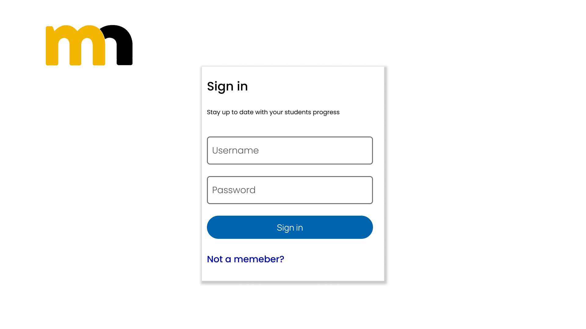
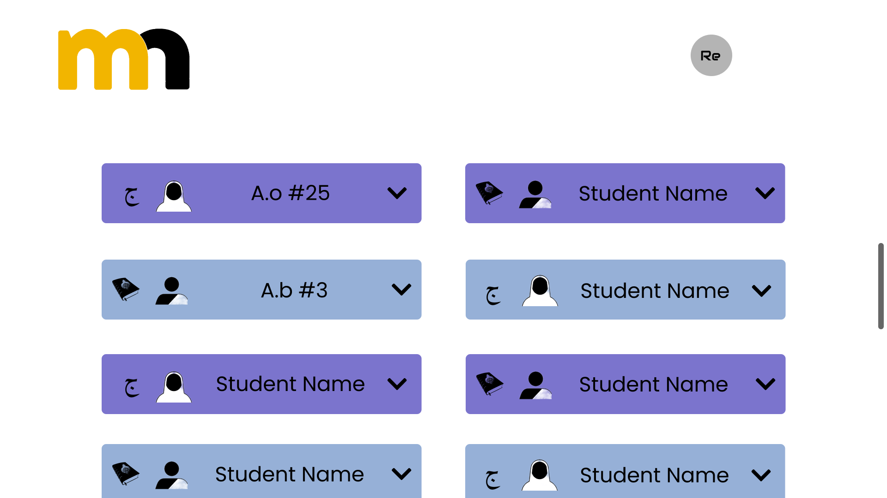
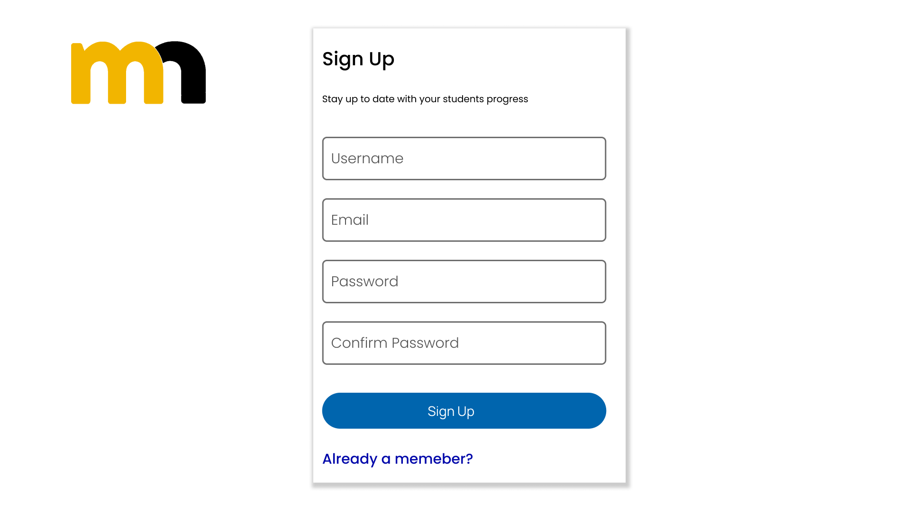
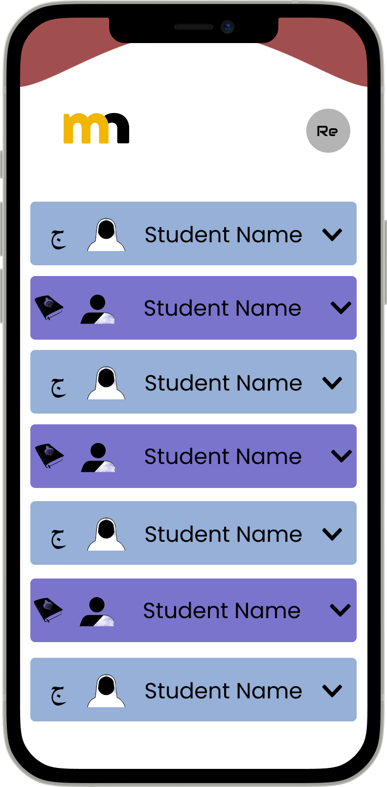
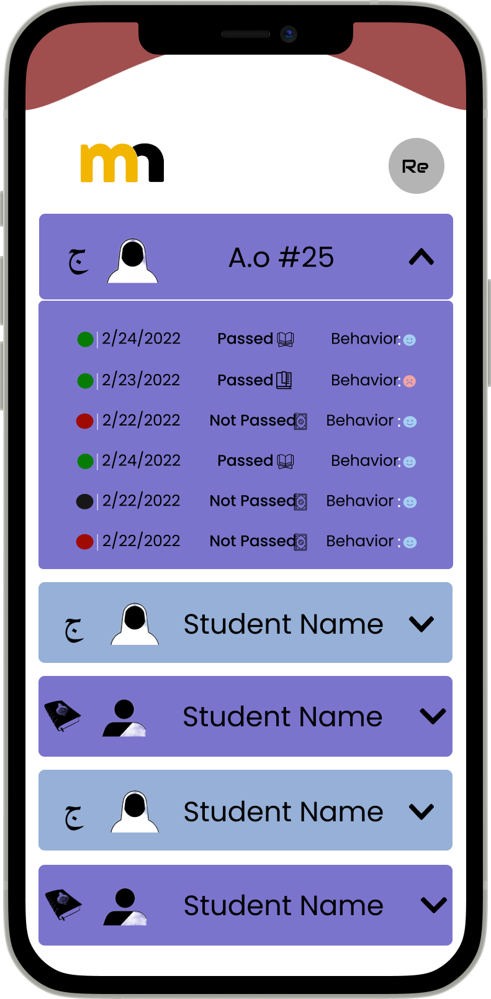

<h1 align="center">Welcome to Markaz-An-Najax 👋</h1>
<p>
  
</p>

> App for Madrasah Students

## Wireframes
### Desktop


***



***



***


***



***



***



## Install

```sh
npm install 
```

## Install

```sh
npm install
```

## Author

👤 **Abdifatah**

* Website: abdifatahosman.com
* Github: [@AbdifatahOsman2](https://github.com/AbdifatahOsman2)

***
